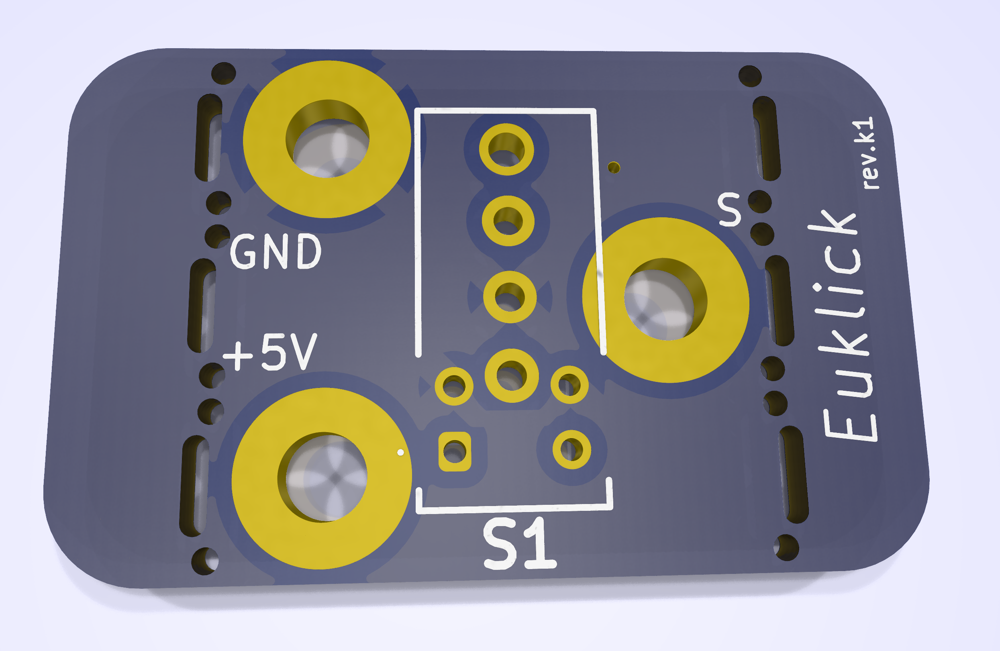
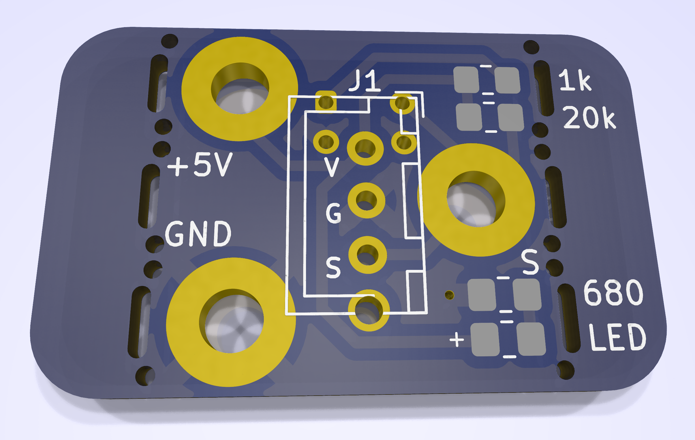
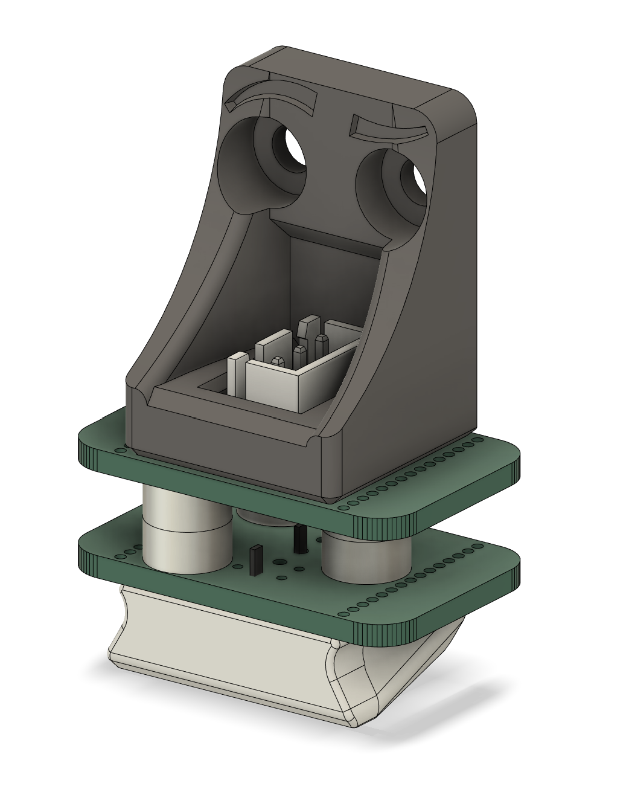
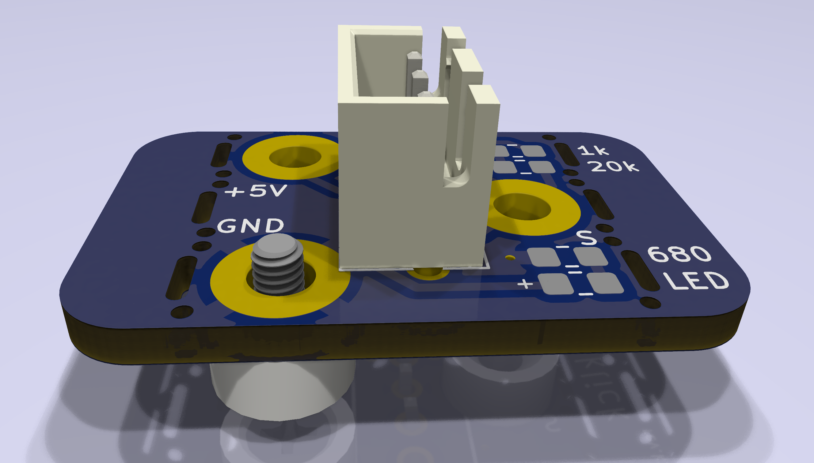
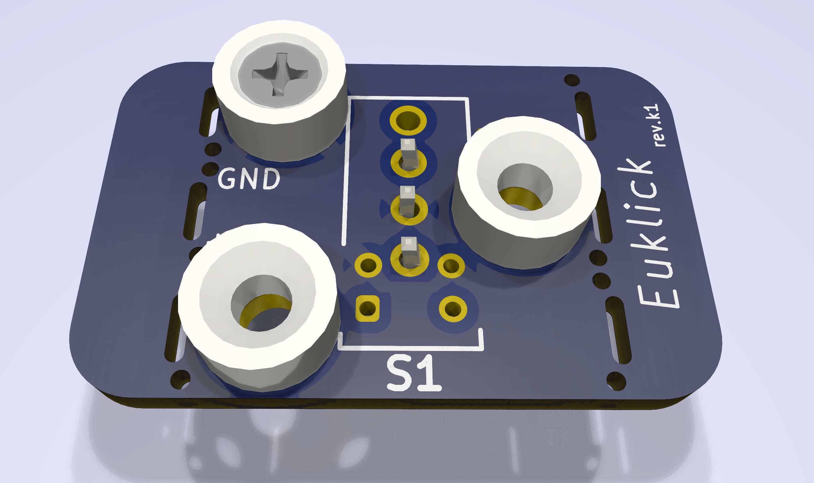
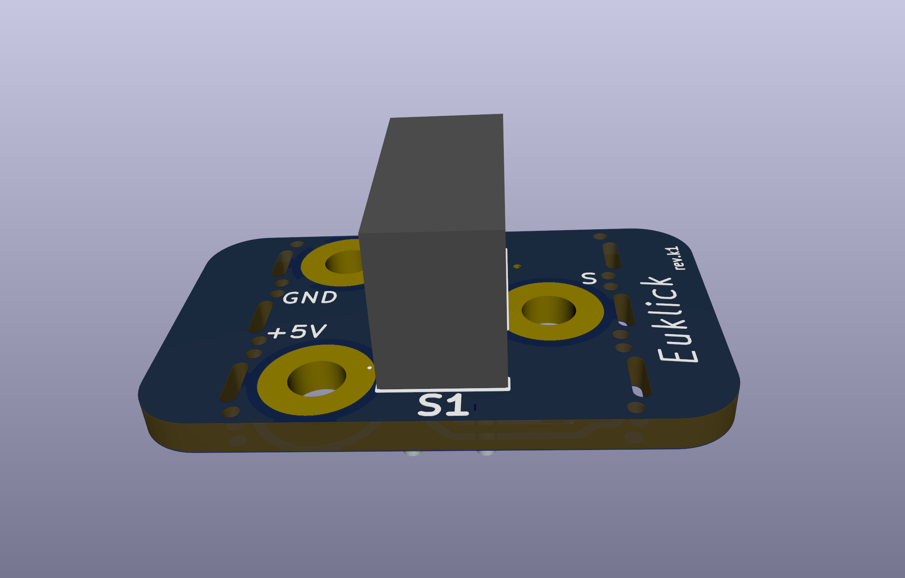
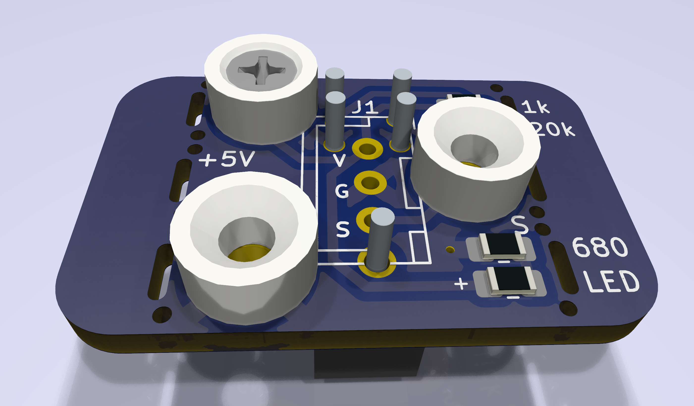

# Euklick BETA

Single PCB 5V optical probe for 3D printers.  Euklick is meant to work with the new Omron optical microswitches of the [D2FP series](https://www.mouser.com/datasheet/2/307/Omron_08182023_D2FP_Datasheet_English-3305532.pdf), specifically the [D2FP-FN2](https://www.mouser.com/ProductDetail/653-D2FP-FN2).  This switch is rated to a *minimum* of **70,000,000** operations, and much tighter tolerances during at the time the switch is pressed.

# The PCB, standing on the shoulder of giants
The PCB borrows, known euphemistically in the music industry as *sampling*, from the designs of the Euclid probe and PCBKlicky.  Unlike PCBKlicky, however, to lower the cost and streamline ordering boards from manufacturers, it makes use of a single board that can be used for both the microswitch (probe), and toolhead side.  Although not necessary, when the board is used in its toolhead holder, the wings / leaves at the end of the board can be snapped as to provide a tighter fit to the plastic parts.  There are cutouts and mouse bites that make it possible to snap the ends, with some force.  The board is mostly compatible with PCBKlicky; nonetheless, the switch is slightly offset from the centerline of the PCB since the pinout for the optical switch changed from the inline package of the older D2F physical switches.  This change makes it possible for the mounted magnets to avoid the soldering pads of the optical switch, while re-using the original magnet positions.
Unlike PCBKlicky, the board only supports 5V as its source of power, and power is not optional (since the optical switch requires active power).

# BOM

| Item | Quantity | Notes |
| ----------- | ------------ | ----------- |
| toolhead PCB | 2 | [gerber files](euklick_production/euklick.zip), [bom](euklick_production/bom.csv), and [cpl](euklick_production/positions.csv) files to order |
| JST-XH 3 pin header | 1 | |
| JST-XH 3 wire pigtail connector | 1| |
| pair of countersunk, matching magnets | 5 | [source](https://www.kjmagnetics.com/proddetail.asp?prod=R422CS-P&cat=15)|
| M2x3.2x4mm heatset inserts | 10 | |
| Omron D2FP-FN2 optical switch | 1 | [source](https://www.mouser.com/ProductDetail/653-D2FP-FN2)|
| Self-tapping stainless torx drive M2 screws | 3 | |
| M3x6mm flat head screws | 2 | |

# Assembly

Two of the boards have to be used for assembly.
For the upper board (board attach to the toolhead), only the JST 3 pin header is necessary, along with three countersunk magnets.  Optionally, the *wings* on the board can be snapped along this line.

For the lower board the switch should be attached from the side marked S1 as here, and the rear of the board should be populated

# License
Free for personal non-comercial use, see the [license](LICENSE.md).  I am [knight_rad.iant](https://discord.com/users/1038855498696499321) on Discord.